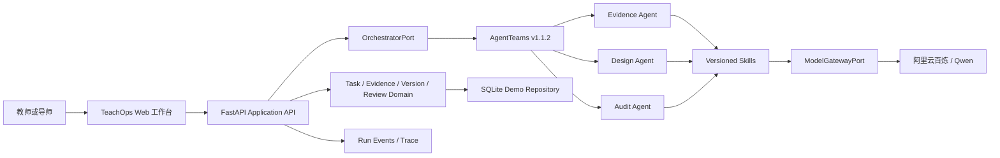

# 研序 TeachOps：GOAI 初赛提交与可运行 MVP 实施方案

> 版本：V1.0  
> 日期：2026-08-12  
> 状态：讨论基线，尚未实施  
> 目标赛道：GOAI 2026「Agent Infra」

## 1. 当前结论

初赛先交付一套能让评委判断项目价值、技术路线和复赛可行性的材料，再用一条可运行的垂直闭环证明方案不是概念包装。

TeachOps 的首个场景定为教师培训机构和师范院校的教学设计预审。主 Demo 使用小学数学公开课例。系统把课标依据、聚合学情、教学设计、质量审查、导师审批和版本记录放进同一条流程。

当前工作区只有两份规格文档，还没有项目代码：

- [研序 TeachOps PRD V1.1](../研序_TeachOps_PRD_V1.1.docx)
- [研序 TeachOps 技术实施与工程规范 V1.1](../研序_TeachOps_技术实施与工程规范_V1.1.docx)

两份文档的产品方向成立，但其中的 P0 接近产品完整版。四天内同步建设组织权限、PostgreSQL、对象存储、RAG、审批、回滚、导出和完整可观测体系，会挤压初赛必交材料和核心演示。比赛 MVP 只保留一个主场景、一个正常分支和一个异常分支。

## 2. 官方要求与判断依据

### 2.1 初赛提交物

根据 [GOAI Agent Infra 赛道页面](https://goaihz.com/en/tracks?track=infra)，初赛阶段重点评估项目方向、技术方案、开放价值和可行性，不强制要求可运行代码。

| 材料 | 是否必交 | 形式 | 主要内容 |
| --- | --- | --- | --- |
| 作品简介 | 是 | 500 字以内文字 | 问题与场景、解决方案、创新与差异、开放复用价值、当前进展 |
| 方案材料 | 是 | PPT 或 PDF | 场景价值、方案设计、Skill 与工具集成、Agent 分工、任务拆解、上下文传递、结果验证、异常分支、安全边界、风险和开源计划 |
| AgentTeams 代码包 | 否 | 仓库链接或压缩包 | 运行入口、依赖与配置、样例输入输出、运行证据 |

官网列出的 Agent Infra 初赛截止日期为 2026 年 8 月 16 日。具体截止时刻、文件大小和上传字段需要在登录后的提交页面再次确认。

### 2.2 赛道硬要求

- 至少设计 3 个职责不同的 Agent。
- 多 Agent 方案以 AgentTeams 为协作设计基线。
- 说明角色编排、任务拆解、上下文传递、协作执行和状态追踪如何映射到 AgentTeams。
- Skill 是必需项，需要给出用途、输入输出、调用条件、依赖工具、失败处理、安全边界和复用价值。
- 在 Agent memory、知识库 RAG、共享状态和轨迹可观测性中至少实现两项。
- 高风险动作需要人工确认、审批、回滚和审计边界。

MCP、RAG 和推荐的阿里云组件不是数量竞赛。评委关注组件是否必要、接口是否清晰、权限是否受控、后续是否可替换。

### 2.3 评分权重

| 维度 | 权重 | TeachOps 的答题重点 |
| --- | ---: | --- |
| 场景价值与行业复制 | 25% | 导师重复预审、教学设计证据不足、评审口径不一致 |
| 多 Agent 协作与闭环 | 25% | Evidence、Design、Audit 的职责冲突，以及人工审批与复验 |
| Skill 工程与生态复用 | 25% | 六个有契约、可测试、可复用的核心 Skill |
| 工程实现、运行验证与安全 | 20% | 状态机、Trace、异常、凭据和审批边界 |
| 开源贡献 | 5% | MIT 仓库、Agent Identity、Skill Schema、样例和评测脚本 |

前三项占 75%。初赛材料必须先把场景、协作和 Skill 讲清楚，不能用基础设施清单代替方案论证。

## 3. 产品范围

### 3.1 首要用户

首要用户是教师培训机构或师范院校中的导师、助教和教学设计学习者。

选择这一场景的原因：

- 同一批次包含多份结构相近的教学设计，重复预审问题清楚。
- 任务、反馈和版本容易形成标准流程。
- 公开课标和合成学情可以支持无敏感数据的比赛演示。
- 后续可以扩展到学校教研组，但初赛不同时讲两个主市场。

### 3.2 需要解决的问题

一次教学设计预审涉及课标、学情、活动安排、评价设计、机构规则和导师意见。现有流程常散落在 Word、聊天和通用大模型中，产生四类问题：

1. 导师反复检查相同的基础缺陷。
2. AI 建议没有可核对的课程依据。
3. 修改前后差异和责任记录难以追踪。
4. 证据不足或规则冲突时，系统仍可能生成看似完整的答案。

### 3.3 产品定义

研序 TeachOps 是面向教师发展和教研组织的多 Agent 教学设计预审与质量治理系统。它将证据整理、方案修改、独立审计、导师审批、复验和版本记录组织成一条可运行、可检查的任务流程。

产品资产是“问题、证据、建议、人工决定、最终版本”的决策记录。模型作为可替换能力接入。

### 3.4 比赛 MVP 不做的内容

- 学生端 AI 学伴。
- 真实学生个人数据和个体风险预测。
- 通用教育平台或 LMS 替代品。
- 完整组织成员、SSO 和多租户权限中心。
- 批量任务、规则市场和 Pattern 自动沉淀。
- 通用 Connector 或 MCP 管理中心。
- Redis、Kubernetes、多区域部署和复杂生产运维。

## 4. 唯一演示场景

### 4.1 课例

主 Demo 使用小学数学教学设计，例如“三年级数学：分数的初步认识”。最终课例需要满足两个条件：

- 课程标准片段来自公开且可引用的来源。
- 学情数据由团队合成并在界面、README 和 PPT 中标注为合成数据。

Demo 输入包括：

- 课程标准片段及来源信息。
- 初版教学设计。
- 不含姓名、学号或联系方式的聚合学情摘要。
- 固定版本的 Rule Pack。

### 4.2 正常流程

```text
DRAFT
  -> EVIDENCE_BUILDING
  -> DESIGNING
  -> AUDITING
  -> WAITING_APPROVAL
  -> REVISING
  -> AUDITING
  -> APPROVED
```

1. 教师提交初版设计和输入材料。
2. Evidence Agent 生成可引用的 Evidence Packet，并列出缺失项。
3. Design Agent 通过 Qwen 生成修改建议，每条关键建议引用 `evidence_id`。
4. Audit Agent 检查目标、活动、评价、学情和规则的一致性。
5. 高风险项进入导师审批。
6. 教师接受或修改建议，系统形成新版本。
7. Audit Agent 复验，通过后由导师批准。

### 4.3 异常流程

异常 Demo 删除一条关键课标依据：

1. Evidence Agent 返回 `E_EVIDENCE_INSUFFICIENT`。
2. 系统保留已经完成的输入检查、统计结果和运行记录。
3. 任务进入待补证状态。
4. 界面关闭批准动作并展示补证入口。
5. 系统不使用模型记忆补写来源，也不把部分执行显示成完整成功。

### 4.4 回滚

- Lesson Version 使用不可变版本链。
- 用户从 v1 回滚到 v0 时，系统生成 v2，而不是覆盖 v0 或 v1。
- 回滚事件记录操作者、原因、目标版本和时间。

## 5. Agent 与人工职责

| 角色 | 职责 | 输入 | 产出 | 禁止动作 |
| --- | --- | --- | --- | --- |
| Manager | 拆解任务、调度步骤、维护状态、触发审批 | 任务与状态引用 | 任务计划、Agent 分派、状态事件 | 判断教学质量、自行批准 |
| Evidence Agent | 整理课标、聚合学情和来源 | 输入材料引用 | Evidence Packet、缺失项 | 编写完整教案、伪造来源 |
| Design Agent | 生成带依据的修改建议 | Evidence Packet、初版教案 | 结构化建议、候选版本 | 发布正式版本、修改 Rule Pack |
| Audit Agent | 独立执行规则和证据审计 | 候选版本、Evidence、Rule Pack | PASS/WARN/FAIL/NA 报告 | 覆盖导师决定、自行批准 |
| 人类导师 | 处理高风险、冲突和正式发布 | Draft、Audit、Diff | 批准、驳回、覆盖或补证决定 | 无理由静默覆盖历史事实 |

人类导师是审批者，不包装成 Agent。Memory Agent 延后到复赛，避免初赛出现五个角色却没有足够真实工作。

## 6. 核心 Skill

比赛 MVP 实现六个 Skill：

| Skill | 用途 | 主要输出 | 失败或降级 |
| --- | --- | --- | --- |
| `build_evidence_packet` | 将课标和材料整理为可引用证据 | Evidence Item、缺失项 | 证据不足时停止 Ready 转换 |
| `analyze_aggregate_learner_profile` | 分析合成聚合学情 | 错误模式、统计摘要 | 列缺失时返回数据质量错误 |
| `generate_lesson_revision` | 通过 Qwen 生成修改建议 | 带 Evidence 引用的结构化建议 | 超时、Schema 不合法时允许重试 |
| `audit_lesson_alignment` | 检查目标、活动、评价和规则 | PASS/WARN/FAIL/NA Findings | LLM 关闭时仍运行确定性规则 |
| `create_version_diff` | 比较教学设计版本 | 字段级或段落级 Diff | 输入版本不存在时拒绝执行 |
| `enforce_approval_gate` | 控制批准、驳回和覆盖 | Review Decision、状态事件 | 高风险未处理时拒绝批准 |

每个 Skill manifest 至少包含：

- `skill_id` 与语义版本。
- 用途和职责边界。
- JSON Schema 输入输出。
- 调用条件与依赖工具。
- 文件、模型和网络权限。
- 超时、重试、幂等和错误码。
- `run_id`、版本、耗时、状态等审计字段。
- 安全说明、样例和测试。

## 7. 技术实施边界

### 7.1 最小架构



### 7.2 技术选择

- Web：Next.js、TypeScript、Tailwind CSS。
- API：FastAPI、Pydantic v2。
- Python 环境：`uv`。
- 比赛存储：SQLite + Repository Port。
- 模型：阿里云百炼/Qwen，通过 OpenAI-compatible 接口调用。
- 协作运行时：AgentTeams stable v1.1.2。
- 本地环境：Docker Desktop。
- 测试：pytest、Vitest、Playwright 和 JSON Schema fixtures。

SQLite 是四天比赛切片，不修改技术规范中长期使用 PostgreSQL 的选择。Repository Port 隔离存储实现，复赛迁移 PostgreSQL 时不修改领域状态机。

### 7.3 AgentTeams 接入

[AgentTeams 官方仓库](https://github.com/agentscope-ai/AgentTeams)显示，Windows 安装依赖 Docker Desktop，最低需要 2 核 CPU 和 4 GB 内存，多 Worker 建议 4 核和 8 GB。稳定默认版本为 v1.1.2，v1.2.0-beta.1 不进入比赛基线。

AgentTeams 负责：

- Manager 与 Workers 的协作房间。
- 人类可见的消息与干预。
- Worker 生命周期和共享文件。
- 模型凭据通过网关隔离。

TeachOps 负责：

- 业务状态、任务事实和版本历史。
- Evidence、Audit 和 Review 数据模型。
- Skill 契约与业务校验。
- 正式审批和审计事件落库。

比赛 WebUI 不复制 AgentTeams 的聊天系统。WebUI展示教学任务对象，AgentTeams提供协作运行证据。

### 7.4 模型配置

- 使用 `ModelGatewayPort`，业务代码不直接依赖 Qwen SDK。
- `.env.example` 只提供变量名和说明。
- API Key 仅存放在本机 `.env` 或 AgentTeams 网关配置中。
- Git、日志、Trace、截图、PPT 和样例不能包含真实 Key。
- Design Skill 提供固定 fixture 降级，用于模型不可用时演示界面和测试状态机。
- fixture replay 必须标注，不能描述成实时模型结果。

### 7.5 上下文能力

初赛实现两项官方要求中的上下文能力：

1. 共享任务状态：Agent 只传 task、artifact 和 Evidence 引用，正式状态保存在 TeachOps Repository。
2. 轨迹可观测性：记录 Agent、Skill、模型、状态变化、耗时和错误。

初赛不实现知识库 RAG。固定公开课例采用显式 Evidence Packet，可以减少四天内的检索质量、向量索引和来源定位风险。

### 7.6 MCP 决策

初赛不为展示技术数量建设 MCP Server。外部能力先通过 Tool/Model Port 接入，并提供参数 Schema、认证、错误、幂等、权限和审计契约。复赛增加 MCP Adapter 时，只转换协议，不重写 Agent 到 Skill 的调用链。

## 8. API 与核心类型

### 8.1 API

| 方法 | 路径 | 用途 |
| --- | --- | --- |
| `GET` | `/api/tasks/{task_id}` | 返回完整任务视图 |
| `POST` | `/api/tasks/{task_id}/actions` | 执行状态动作 |
| `GET` | `/api/runs/{run_id}/events` | 返回运行轨迹 |
| `GET` | `/api/skills` | 返回可审查的 Skill manifests |

任务动作使用带 `idempotency_key` 的联合类型：

- `BUILD_EVIDENCE`
- `GENERATE_REVISION`
- `RUN_AUDIT`
- `APPROVE`
- `REJECT`
- `ROLLBACK`
- `RESET`

### 8.2 核心类型

- `TeachingTask`
- `EvidenceItem`
- `LessonVersion`
- `AuditFinding`
- `ReviewDecision`
- `RunEvent`
- `SkillManifest`

### 8.3 最低错误集合

- `E_INPUT_MISSING`
- `E_EVIDENCE_INSUFFICIENT`
- `E_RULE_CONFLICT`
- `E_MODEL_TIMEOUT`
- `E_MODEL_SCHEMA_INVALID`
- `E_VERSION_CONFLICT`
- `E_PERMISSION_DENIED`
- `E_AGENT_RUN_FAILED`

API 使用 RFC 9457 Problem Details 结构返回错误。界面需要区分业务阻断、可重试系统错误和完成状态。

## 9. 初赛材料设计

### 9.1 500 字作品简介结构

最终文案控制在 500 个中文字符以内，包含：

1. 教师培训/师范院校的具体场景。
2. 导师预审的证据、重复劳动和版本问题。
3. Evidence、Design、Audit、Human Review 闭环。
4. Evidence 引用和审批边界这两个差异点。
5. Agent Identity、Skill contracts、样例和评测的开源范围。
6. 截止提交时已经完成的真实进展。

简介不能提前声称“系统已运行”“准确率达到某数值”或“节省某百分比”。完成验证后再写对应结果。

### 9.2 12 页 PPT/PDF

| 页码 | 内容 | 所需证据 |
| ---: | --- | --- |
| 1 | 项目定义与一句话价值 | 产品定位 |
| 2 | 教学设计预审流程和痛点 | 公开流程材料、问题拆解 |
| 3 | 现有方案的缺口 | 竞品官网、流程差异 |
| 4 | 小学数学固定 Demo 输入 | 公开课标、合成学情标识 |
| 5 | 正常业务闭环 | 状态图 |
| 6 | 四个 Agent 和人工导师 | Agent Identity 表 |
| 7 | AgentTeams 映射 | 真实配置或清晰架构映射 |
| 8 | 六个 Skill | Schema 和失败边界 |
| 9 | 系统数据流和安全边界 | 架构图、凭据和数据分类 |
| 10 | 正常、异常和回滚 | 截图、Trace、测试结果 |
| 11 | 可复现性和限制 | README、命令、已知问题 |
| 12 | MIT 开源与复赛路线 | 仓库结构、计划 |

每张运行截图标明证据类型：

- `live`：本次真实运行。
- `local-demo`：本地应用行为。
- `fixture replay`：固定数据回放。
- `design mockup`：尚未实现的设计稿。

## 10. 四天工作安排

### 8 月 12 日：冻结范围

- 核对登录后的官方模板、提交字段和截止时刻。
- 启动 Docker Desktop，检查 Docker Server。
- 使用最小请求验证 Qwen API Key 和模型名。
- 建立项目骨架、固定课例、Agent Identity 和 Skill manifests。
- 完成作品简介 v1 和 PPT 逐页提纲。

验收：Qwen 请求成功；Docker Server 可用；简介少于 500 字；PPT 每页有明确结论和证据需求。

### 8 月 13 日：确定性闭环

- 实现领域状态机和 SQLite Repository。
- 实现 Evidence、Audit、Diff 和 Approval Skills。
- 准备正常样例和缺失课标样例。
- 完成领域单元测试和 API 定向测试。

验收：关闭模型后，证据构建、确定性审计、审批阻断和回滚仍能执行。

### 8 月 14 日：Web MVP

- 完成单任务工作台。
- 展示 Evidence、Draft、Audit 和 Review 四区信息。
- 接入 Qwen Design Skill 和结构化输出校验。
- 记录运行事件、耗时和错误。

验收：浏览器从 DRAFT 运行到 APPROVED；关键建议可回到 Evidence；模型错误不会显示成成功。

### 8 月 15 日：AgentTeams 与运行证据

- 安装并验证 AgentTeams v1.1.2。
- 建立 Manager、Evidence、Design 和 Audit 角色。
- 使用同一固定课例完成一次协作。
- 完成异常分支、回滚和 Playwright E2E。
- 生成真实截图、测试日志和运行报告，替换 PPT 占位内容。

当天结束后停止增加功能，只修复阻塞缺陷和材料错误。

### 8 月 16 日：提交

- 上午定稿作品简介、PPTX/PDF、README 和公开仓库。
- 从干净环境执行一次启动和核心流程。
- 检查 PDF 字体、图片、页码、链接和敏感信息。
- 中午前形成最终提交包，为平台上传和网络问题预留时间。

## 11. 降级与停止线

### 11.1 AgentTeams

Docker Desktop 启动后先做安装烟雾测试。如果 AgentTeams 在 90 分钟内仍未完成基础启动和最小 Team 验证，停止继续排障：

- Web MVP 改用实现同一 `OrchestratorPort` 的 `local-demo` Adapter。
- 保留 Agent Identity、Skill 和 AgentTeams 映射设计。
- PPT 明确写“AgentTeams 集成未完成”，不使用模拟日志冒充框架运行。

### 11.2 模型

Qwen API 不可用时：

- 保留 Evidence、Audit、Approval 和 Version 的真实运行。
- Design Skill 使用固定 fixture replay。
- PPT 标注模型结果来源和失败原因。
- 不在截止日前更换多个模型平台并扩大排障面。

### 11.3 时间

优先级固定为：

1. 作品简介和 PPT/PDF。
2. 正常与异常闭环。
3. 可复现 README 和测试证据。
4. AgentTeams 实时协作。
5. 视觉细节和非核心功能。

任何第四、第五级任务都不能延误必交材料。

## 12. 测试与验收

| 场景 | 通过标准 |
| --- | --- |
| 正常闭环 | 四个 Agent 或对应真实步骤都有产出，任务到达 APPROVED |
| Evidence 引用 | 关键建议和风险可回溯到 `evidence_id` 或 `rule_id` |
| 证据不足 | 系统阻止批准并提示补证 |
| 规则冲突 | 系统进入人工决策，不自动选择规则 |
| 模型异常 | 超时或 Schema 错误可见、可重试，确定性结果保留 |
| 人工控制 | 高风险未处理时 `APPROVE` 返回错误 |
| 版本回滚 | 系统生成新版本，原历史和决定保持不变 |
| 安全 | Key、完整敏感正文和个人信息不进入 Git、日志或截图 |
| 可复现 | 新环境按 README 能启动固定样例 |
| 真实性 | PPT、README 和演示区分 live、local-demo、fixture 和 mockup |

初赛完成标准：按时提交两项必交材料，公开仓库能运行核心流程。AgentTeams 真实协作是高优先级工程目标，但不能挤占必交材料。

## 13. 开源范围

初赛核心仓库采用 MIT License，计划开放：

- Agent Identity 定义。
- 六个 Skill manifests 和 JSON Schemas。
- 公开课标引用与合成样例。
- 核心状态机、API、Web 工作台和 Adapter 接口。
- 单元测试、E2E 和评测脚本。
- 本地启动、配置和安全说明。

仓库不包含：

- API Key、账号、Cookie 或本地凭据。
- 真实学生或教师数据。
- 没有授权的教材全文、教案或图片。
- 无法说明许可证的第三方材料。

## 14. 已知限制

- 当前没有教师、师范生或导师的真实访谈和标注数据。
- 初赛只能用公开材料与合成学情证明工程闭环，不能证明真实组织采用效果。
- SQLite、固定课例和单任务工作台只服务比赛 MVP。
- 方案尚未验证 AgentTeams 在本机 Docker 环境中的安装与稳定性。
- Qwen 的 API Key、模型权限和余额尚未在本项目中验证。
- 官网公开页面没有给出精确截止时刻，必须登录参赛系统核对。

## 15. 下一阶段决策

初赛提交后，根据评审反馈决定复赛投入。复赛优先补齐三类证据：

1. 邀请 1 至 3 名导师或师范生评审固定课例，记录接受、修改和拒绝理由。
2. 将 Repository 切换到 PostgreSQL，并补充租户与权限测试。
3. 完成 AgentTeams 可执行包、在线或本地 Demo、Trace、评测结果和部署说明。

在获得真实用户反馈前，不建设批量任务、规则市场或区域平台能力。

